# 🔐 PRIVYSE

### Your browser agent. Your data. Your privacy.

> **Track · SIH 26171 — On-device Visual Perception for Lightweight Browser Agents**

PRIVYSE is a **privacy-preserving browser agent** that understands webpages locally, detects and redacts sensitive information, verifies the sanitized payload through a **fail-closed privacy gate**, and only then allows an AI model to reason over the page.

> 📌 **Two open High-severity defects are documented in this README, not hidden.** One of them
> (D2) currently bounds the privacy claim. See
> [Open defects](#open-defects-self-audited-not-yet-fixed) before describing the boundary
> as airtight.

### `CAPTURE → SANITIZE → GATE → REASON → ACT`

**Your screen never leaves the device — and you can watch the gate every step of the way.**

<p align="center">

[]()
[]()
[]()
[]()
[]()
[]()

</p>

<p align="center">

[]()
[]()
[]()
[]()
[]()
[]()

</p>

---

## Table of Contents

- [What is PRIVYSE?](#what-is-privyse)
- [The Core Idea](#the-core-idea)
- [Three-Tier Privacy System](#three-tier-privacy-system)
- [On-Device Visual Perception](#on-device-visual-perception)
- [The Zero-Leak Gate](#the-zero-leak-gate)
- [Perception-Driven Model Routing](#perception-driven-model-routing)
- [End-to-End Architecture](#end-to-end-architecture)
- [The Privacy Gate in Action](#the-privacy-gate-in-action)
- [Features](#features)
- [Guarded Action Execution](#guarded-action-execution)
- [Benchmark Results](#benchmark-results)
- [Latency](#latency)
- [Security and Adversarial Testing](#security-and-adversarial-testing)
- [⚠️ Open defects (self-audited)](#open-defects-self-audited-not-yet-fixed)
- [Indian PII Coverage](#indian-pii-coverage)
- [Tech Stack](#tech-stack)
- [Project Structure](#project-structure)
- [Getting Started](#getting-started)
- [Running the Benchmarks](#running-the-benchmarks)
- [Roadmap](#roadmap)
- [Why PRIVYSE Is Different](#why-privyse-is-different)
- [SIH 26171](#sih-26171)

---

## What is PRIVYSE?

Traditional computer-use agents capture the **raw browser screen** — every email, phone number, PAN, card, face and password — and ship those pixels to a remote vision-language model.

That single habit can expose:

- 📧 Emails
- 📱 Phone numbers
- 💳 Card information
- 🪪 Government IDs (Aadhaar · PAN · voter ID · passport · driving licence)
- 🔑 Passwords / OTPs / API keys
- 👤 Faces
- 📄 Sensitive documents

**PRIVYSE changes the order of operations.** The AI never gets the browser first. Privacy comes first — a **sanitizer** sits between the camera and the model, and a **fail-closed gate** proves the pixels leaving are clean:

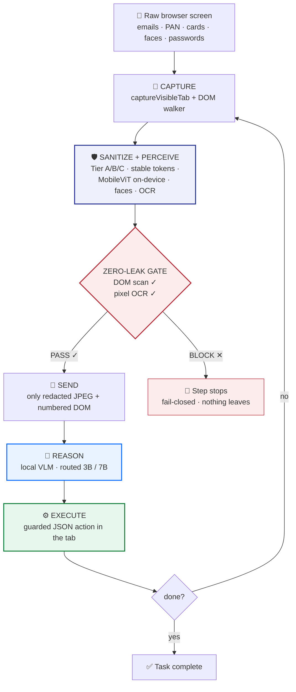

---

## The Core Idea

PRIVYSE places a **privacy choke point between the browser and the AI**. The model perceives only what the gate approves:

> **sanitized screenshot + numbered DOM + compact on-device perception context**

Never the raw screen.

Every step flows through the same, visible pipeline:

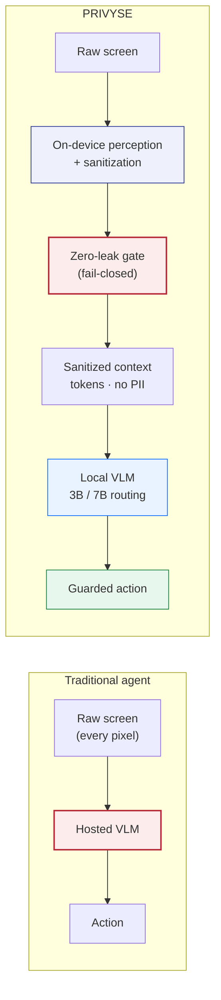

The privacy layer isn't bolted on afterwards — it is the architecture. Trust is **demonstrated, not promised**: the gate is visible in the side panel, and a `GATE PASS` / `BLOCKED` flash fires on every step.

---

## Three-Tier Privacy System

Sensitive information is classified into three tiers, each with a different protection strategy:

| Tier          | Information                                         | Protection            |
| ------------- | --------------------------------------------------- | --------------------- |
| 🔴 **Tier A** | Passwords, OTPs, CVVs, API keys                     | Solid black           |
| 🟠 **Tier B** | Email, phone, PAN, Aadhaar, cards, names, addresses | Stable privacy tokens |
| 🟣 **Tier C** | Faces, canvas text, video, non-DOM graphics         | Blur / region taint   |

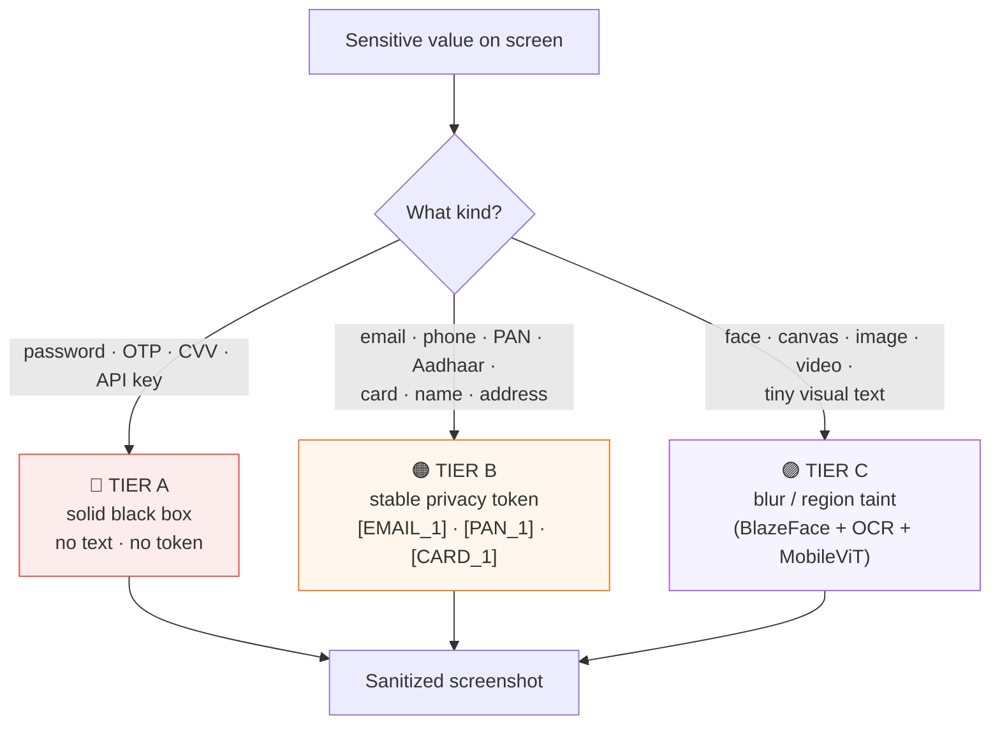

### Stable tokenization

Instead of destroying context, Tier B rewrites values into predictable tokens that stay **stable across the run** — the same value always maps to the same token, so the model keeps continuity without ever seeing the raw secret:

```text
john@example.com           4111 1111 1111 1111          9876543210@ybl
       ↓                           ↓                          ↓
   [EMAIL_1]                   [CARD_1]                   [UPI_1]
```

Cross-source continuity is intentional: a value discovered by OCR in an image gets the *same* token when it later appears in the DOM.

---

## On-Device Visual Perception

PRIVYSE doesn't rely exclusively on the DOM. Modern pages hide sensitive content in `<canvas>`, SVG, images, videos, rendered graphics and tiny visual text — regions the DOM never carries.

So a **MobileViT-Small (quantized ONNX)** runs directly inside the browser, in parallel with BlazeFace and Tesseract OCR:

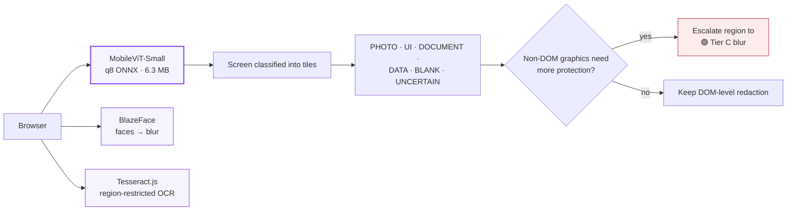

Everything is bundled locally — **no CDN model downloads** (~56.9 MB total on-device assets, 0 MB off-device). The MobileViT output is also compressed into a compact `ON-DEVICE PERCEPTION` block that ships to the server so the VLM reasons from locally-observed structure rather than blind pixels.

### WebGPU acceleration with automatic WASM fallback

The ViT runs on **ONNX Runtime Web** with the **WebGPU execution provider first**: when `navigator.gpu` is present the tiles are classified on the GPU, and any op the WebGPU EP lacks falls through to the bundled WASM EP — the same `.jsep` runtime serves both, so nothing is re-downloaded. Machines without WebGPU (or where WebGPU init fails) transparently run the WASM EP. The active provider is surfaced live in the side panel resource meter (`perception · ⚡ WebGPU` / `wasm`), and `webgpu` is reported alongside the tile tags in the perception stats.

When the page hasn't visually changed, the pixel-hash **same-page cache** reuses the tile map in `0 ms` — faces, OCR and the gate still run fresh every step.

---

## The Zero-Leak Gate

The most important component isn't the model — it's the **gate**.

Before anything crosses the privacy boundary, PRIVYSE performs **two independent checks**:

1. **DOM verification** — the outbound DOM JSON is regex-scanned for sensitive values.
2. **Pixel verification** — the *actual sanitized screenshot* (the bytes that would be uploaded) is OCR-scanned again.

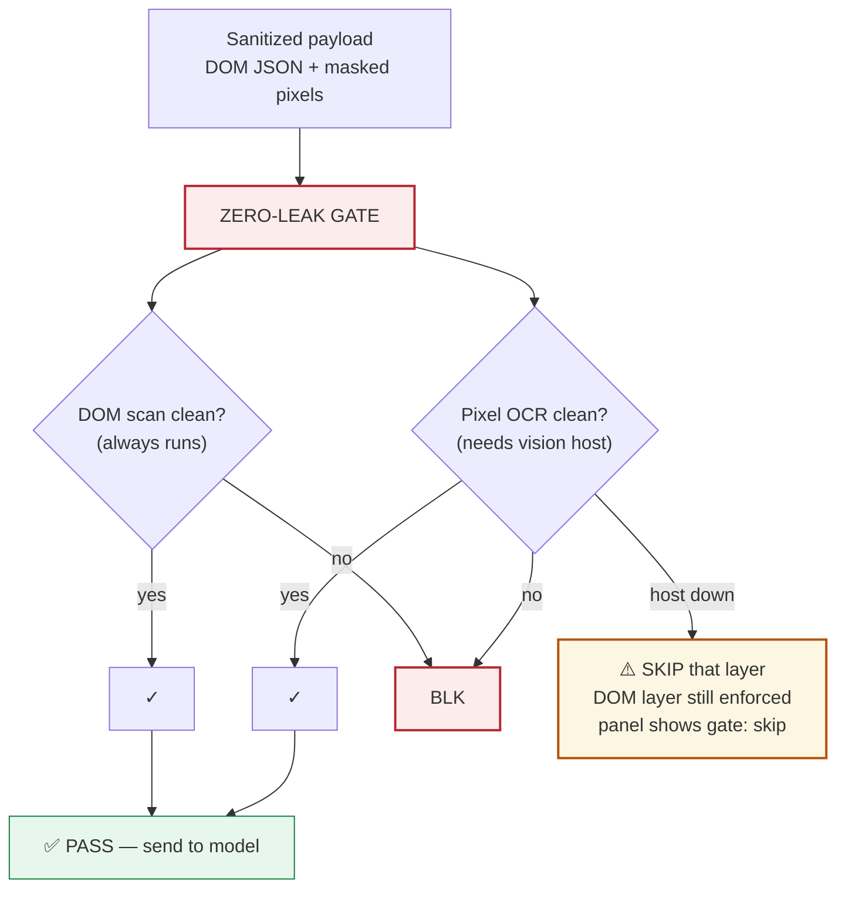

### Fail-closed by design — with one stated exception

The two layers do not fail in the same way, and it is worth being precise about it:

| Layer | Runs when | If the check fails | If the layer can't run |
| --- | --- | --- | --- |
| **1 — DOM scan** (`assertNoLeaks`) | **Always.** Pure regex over the outbound JSON; needs no DOM context and no model | 🛑 **Blocked** | n/a — cannot be skipped |
| **2 — Pixel OCR** | Only pages with non-DOM surfaces, and only when the vision host is up | 🛑 **Blocked** | ⚠️ **Skipped** — the step proceeds on layer 1 alone, and the side panel reports `gate: skip` |

So a **DOM-layer** failure can never send. A **pixel-layer** check that runs and finds PII can never
send either. But if the on-device vision host is down, PII that exists *only in pixels* is not
OCR-verified on that step. This is a deliberate degradation — blocking every image-heavy page
indefinitely would make the agent unusable — and it is recorded in
[`docs/perception-failure-path-audit.md`](docs/perception-failure-path-audit.md), which walks all
nine failure paths. It is a real, narrow gap, not a claim of airtightness.

---

## Perception-Driven Model Routing

The on-device MobileViT map tells the server *how much reasoning this step needs* before the model is even called:

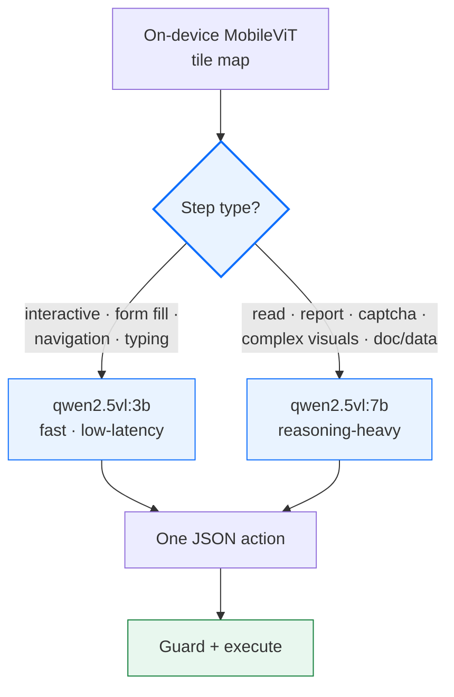

- `server/routing.py` — opt-in via env; a client-supplied `model` **always wins**.
- Interactive steps on the 3B are ~2.5× faster than the 7B read path; the 7B is reserved for prose and visual reasoning.
- The chatty small model is not trusted blindly — streamed actions are validated, coerced (`resolve_target` accepts `[6]`, `6.0` and single-element arrays) and **guarded** before execution.

| Routing config | Visual-context tasks | Steps |
| -------------- | -------------------: | ----: |
| `qwen2.5vl:3b` | 2 / 3 | 4.7 |
| `qwen2.5vl:7b` | 3 / 3 | 1.3 |
| Routed 3B / 7B | 2 / 3 | 5.0 |

> The routed read/report failure is root-caused to the harder Sep-7 test page (prose + long-form), not to the routing logic; accuracy on interactive tasks is 3/3.

---

## End-to-End Architecture

<p align="center">

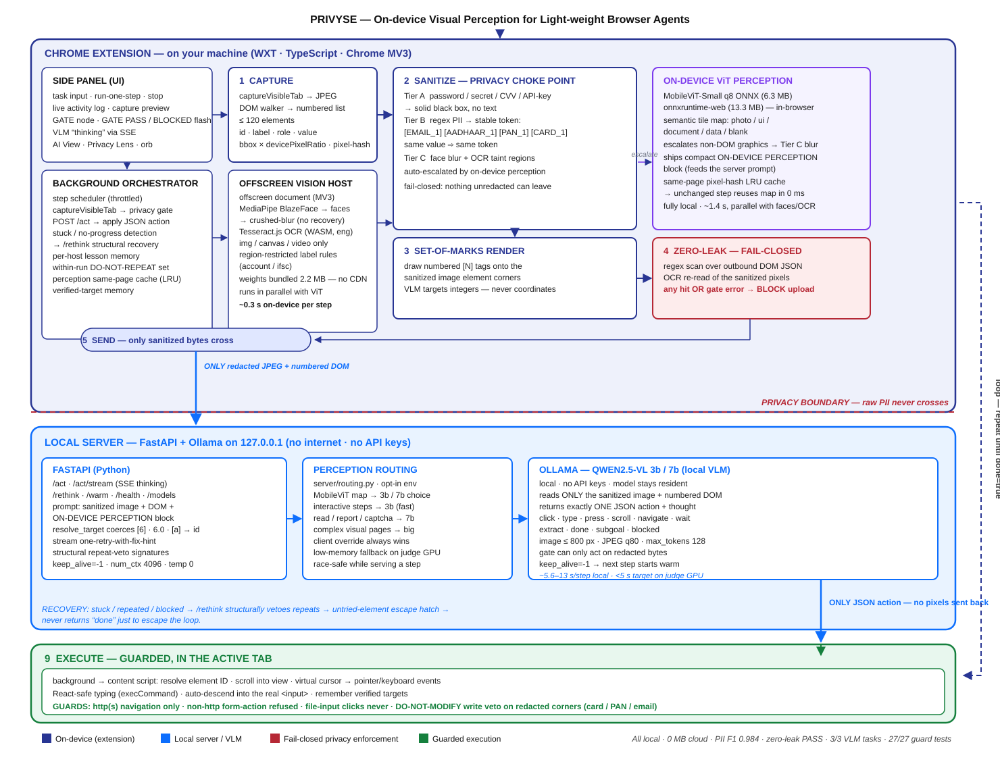

</p>

### One browser-agent step

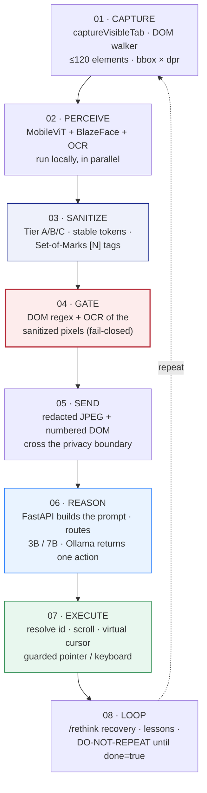

1. **01 — Capture.** `captureVisibleTab` grabs the viewport; the DOM walker serializes interactive elements (`id · label · role · value`, `bbox × dpr`, ≤ 120 elements) and hashes pixels for the perception cache.
2. **02 — Perceive.** MobileViT, BlazeFace and region-restricted OCR run locally, in parallel — images/canvas/videos get taint boxes, faces get crushed-blur, graphics get escalated.
3. **03 — Sanitize.** Tier A secrets → solid black; Tier B PII → stable tokens; Tier C regions → blur. Set-of-Marks paints numbered `[N]` tags over the result so the VLM targets *integers, never coordinates*.
4. **04 — Gate.** The outbound DOM JSON is regex-scanned **and** the sanitized screenshot pixels are OCR'd again. Any hit, or any gate error → `BLOCKED`.
5. **05 — Send.** Only the redacted JPEG + numbered DOM cross the privacy boundary to the local FastAPI server.
6. **06 — Reason.** FastAPI builds the prompt (image + DOM + perception block) and routes 3B/7B from the tile map. Ollama returns exactly **one** JSON action.
7. **07 — Execute.** The content-script executor resolves the element id, scrolls it into view and drives pointer/keyboard events — through a guard layer.
8. **08 — Loop.** Stuck/repeated steps trigger `/rethink` (structural repeat-veto + untried-element escape hatch) until `done=true`.

---

## The Privacy Gate in Action

Three real screenshots of the same GT-labelled KYC page (`test-site/india-pii.html`) — UPI, voter ID, driving licence and passport fields — processed through the **actual production pipeline**:

| 👤 Your screen (what a naive agent uploads) | 🚪 The gate's view | 🤖 What the model receives |
| :---: | :---: | :---: |
| 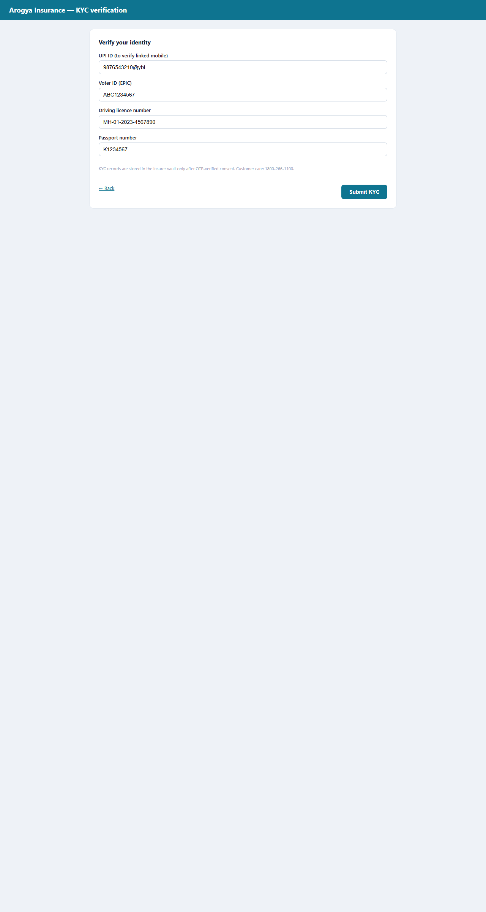 | 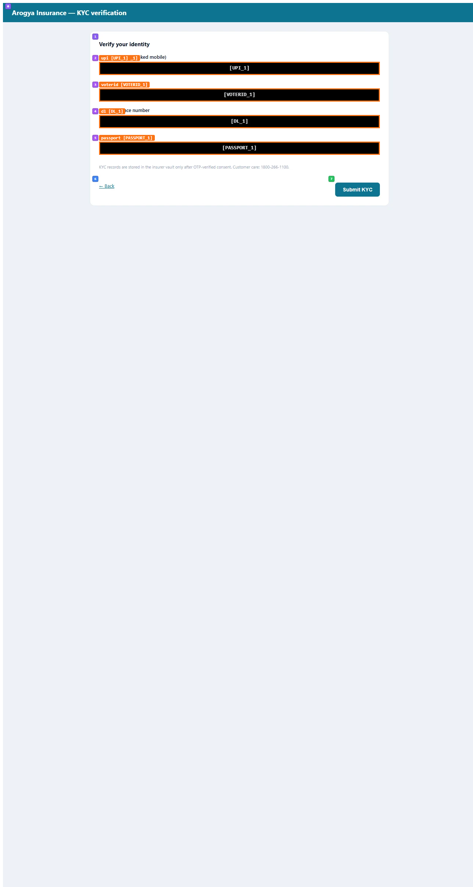 | 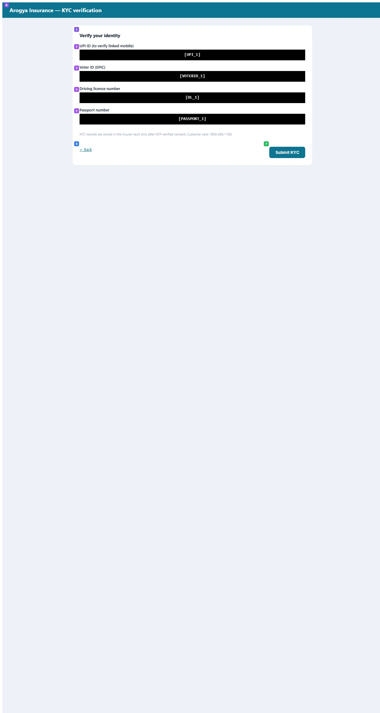 |

The gate-report view (middle) overlays the redaction boxes the pipeline recorded — each tagged with its tier and token. The model view (right) is precisely the bytes that cross the privacy boundary: **no raw value survives**.

Two further checks (not pictured): the zero-leak gate OCR's the right-hand image itself, and the executor's *DO-NOT-MODIFY* veto would reject a hostile `/act` that tries to write a new value into those fields.

---

## Features

### 🎛️ Side panel control center

Task box, live agent-state pill, and a 5-stage pipeline strip with a **GATE node** that flashes `PASS` / `BLOCKED` each step. A privacy hero card shows `detected / protected / raw-values-sent`, the stable-token map (`jes***@gmail.com → [EMAIL_1]`), a before/after *"Your screen vs. what the AI sees"* pair, a structured decision trace, an activity log and session history.

### 🔎 Privacy Lens

One-key live scan that highlights every sensitive region on the page — red rings plus type tags:

```text
🔴 EMAIL   🔴 PHONE   🔴 CARD   🔴 PAN   🔴 AADHAAR
```

### 👁️ AI View mode

Flip the page into **exactly what the model sees** — PII rewritten to stable tokens plus Set-of-Marks chips on every interactive element:

```text
USER VIEW                           AI VIEW
────────────                        ────────────
John Doe                            [NAME_1]
john@example.com                    [EMAIL_1]
4111 1111 1111 1111                 [CARD_1]
Amount: ₹45,999                     [AMOUNT_1]
────────────                        ────────────
```

### 🟢 Floating PRIVYSE orb

A draggable status dot that expands into a live pill (`CAPTURE · SANITIZE · GATE · REASON · ACT · step n`) while the panel is closed — and hides itself during every capture.

### ⌨️ Spotlight

`Alt + K` page command palette — run, step-one, stop, cursor toggle, model switching, VLM health check, and toggles for the orb / Privacy Lens / AI View.

---

## Guarded Action Execution

The AI doesn't get unrestricted browser control. Every action passes guard functions (`extension/core/action-guards.ts`) that refuse:

```text
javascript:    file:    data:    blob:    about:
non-http form actions      file-input interaction
writes that would replace a protected value
```

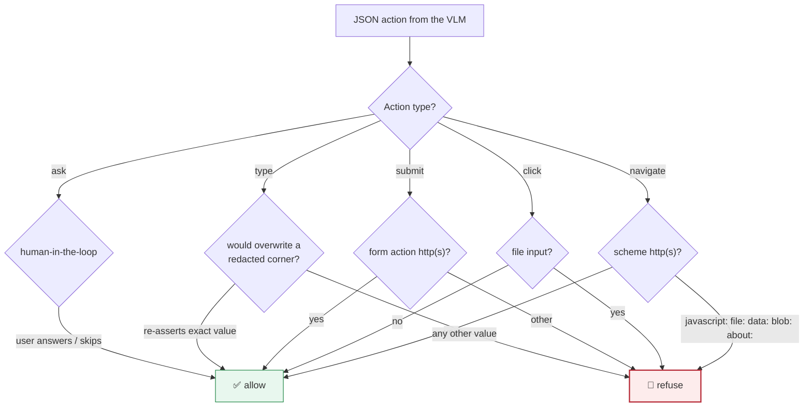

### 👤 Human-in-the-loop (`ask`)

Before irreversible or ambiguous steps, the agent pauses and **asks the user in real time** — the VLM emits an `ask` action (`{ type: "ask", question, options? }`), which is **never dispatched to the page**. The background loop surfaces it as a card in the side panel *and* a shadow-DOM banner on the page, then blocks until the answer:

- **Answer / Skip** → the reply is fed back into VLM context as the step result (`USER ANSWER: …` / `USER SKIPPED …`) and the loop continues. A 25 s safety net (`ASK_TIMEOUT_MS`) auto-skips if no UI is reachable.
- **Risky-action confirm** (default on, "Confirm risky actions" toggle in the side panel) — deterministic gate, not model-driven: task-complete `done` and cross-origin `navigate` pause for a **Proceed / Cancel** choice. Cancel blocks the action and injects a `USER CANCELED` warning so the loop must rethink, never retry it. (Routine Enter submissions are NOT gated — gating every Enter froze the loop.)

### DO-NOT-MODIFY veto

If a field's current value would be redacted by the sanitizer, the agent can only **re-assert the exact same value** — it can never replace or erase it. The `DO-NOT-MODIFY` veto is deterministic, so it also defends the golden corners (card / PAN / email) against a **hostile or malformed `/act` response** — not just an honest model making a mistake.

---

## Benchmark Results

All numbers from `benchmarks/results/dashboard.json` + the suite runners (GT-labelled pages, auto-generated):

| Metric                   |            Result |
| ------------------------ | ----------------: |
| **PII detection F1 (px)**|         **0.984** |
| Precision                |         **0.968** |
| Recall                   |         **1.000** |
| Zero-leak                |          **PASS** |
| Face detection (Tier C)  |           **2/2** |
| Canvas account (OCR)     |           **2/2** |
| IFSC detection           |           **1/1** |
| ViT page classification  |           **7/7** |
| Photo vs. blank accuracy |          **100%** |
| Routed VLM accuracy      |           2 / 3 |
| Adversarial suite        | **30/30 blocked** |
| Executor guard tests     |         **27/27** |
| Raw data off-device      |          **0 MB** |
| On-device assets         |       56.9 MB (incl. WebGPU/WASM runtimes) |

Zero-leak is verified **twice**: `scanForLeaks` (regex over the outbound DOM JSON) *and* an OCR pass over the sanitized screenshot pixels — the exact bytes that would be uploaded. Pixel precision/recall come from rasterized masks of predicted vs. GT boxes clipped to the captured viewport.

---

## Latency

### Current measured performance

```text
7B only                ≈ 19 – 21 s / step
Routed 3B / 7B         ≈ 12.7 – 13 s / step
Interactive steps (3B) ≈ 7.5 – 8.0 s
On-device vision       ≈ 1.7 s  (faces + OCR + MobileViT, parallel)
OCR gate               ≈ 0.5 s
```

### Perception cache

When the page hasn't visually changed, the MobileViT map is reused from the pixel-hash LRU:

```text
First perception   ≈ 1.4 s
Cached perception  ≈ 0 ms
```

Faces, OCR and the privacy gate still run **fresh** every step.

### Judge target

```text
┌──────────────────────────────────┐
│          JUDGE TARGET            │
│       p50 < 5 s / step           │
│   (routed 3B/7B on ≥7B VRAM)     │
└──────────────────────────────────┘
```

The full latency budget model is documented in [`docs/latency-budget-judge-gpu.md`](docs/latency-budget-judge-gpu.md).

---

## Security and Adversarial Testing

PRIVYSE is evaluated against attacks a real deployment would face:

- Canvas PII · SVG PII · tiny text · image-based PII
- Obfuscated sensitive values
- Visual prompt injection · text prompt injection
- Exfiltration attempts (`data:`/`blob:`/`javascript:` form actions)
- Hostile `/act` responses
- Non-HTTP navigation · file inputs
- Protected-field overwrite attempts

| Suite                           | Result |
| ------------------------------- | ------:|
| Adversarial privacy pipeline (`adversarial-bench.mjs`) | **30 / 30** blocked |
| Executor security tests (`executor-guard.test.mjs`)    | **27 / 27** passed |
| Live /act spot-check (`act-spot-check.mjs`)             | **10 / 10** (forged hostile responses refused through the real executor + a live server round trip) |

> Known flake: the zero-leak OCR gate is occasionally nondeterministic (1 failure in ~4 full runs, a blur-sample variance on one image page) — never a leak; it fails *closed* (blocks the step) when the OCR can't confirm.

### Open defects (self-audited, not yet fixed)

Found by our own audit of the human-in-the-loop path, documented in
[`docs/hitl-test-matrix.md`](docs/hitl-test-matrix.md). Listed here rather than buried, because a
reader should not have to take the privacy claim on trust:

| ID | Severity | Defect | Status |
| --- | --- | --- | --- |
| **D2** | **High** | `history[].result` and the user's `task` string are attached to the outbound body **untokenized** (`core/sanitizer.ts`), and layer 1 of the gate only walks `body.dom[].text/value` (`core/zero-leak.ts`). PII typed into a human-in-the-loop answer would therefore leave in plaintext **with the gate blind to it**. | **Open — queued first** |
| **D1** | **High** | The risky-action confirm detects Cancel only via `startsWith("cancel")`, so typing `no` (or any other non-`cancel` answer) **executes** the action — including `done` on a payment flow. Needs an explicit allow-list. | Open |

**D2 is the one that matters.** Until it is closed and verified, the privacy boundary should be read
as: *DOM-sourced PII is provably blocked; PII introduced through the agent's own conversation with
the user is not yet covered.* The fix is narrow — tokenize `task` and `history[].result` through
the same stable-token path as the DOM, and extend `scanForLeaks` to walk them.

Safety in the meantime rests on the strict JSON action schema, the deterministic executor guards,
and the HITL confirmation — not on the gate alone.

---

## Indian PII Coverage

Dedicated detection patterns for Indian identifiers, all at **100% precision / recall** on the GT benchmark:

- UPI IDs · Voter ID / EPIC · Driving Licence · Passport
- PAN · Aadhaar · Indian banking (account number + IFSC)

```text
9876543210@ybl     →   [UPI_1]
ABC1234567         →   [VOTERID_1]
MH-01-2023-4567890 →   [DL_1]
K1234567           →   [PASSPORT_1]
ABCDE1234F         →   [PAN_1]
XXXX XXXX 3456     →   [AADHAAR_1]
```

---

## Tech Stack

| Layer             | Technology |
| ----------------- | ---------- |
| Extension         | TypeScript · WXT · Chrome Manifest V3 **+ Firefox Manifest V2** |
| On-device vision  | MobileViT-Small (q8 ONNX) · ONNX Runtime Web · BlazeFace · Tesseract.js (WASM) |
| Backend           | FastAPI · Python · Ollama · Qwen2.5-VL 3B / 7B |
| Privacy core      | DOM PII detection · stable tokenization · tiered redaction · zero-leak gate · pixel-hash perception cache · fail-closed design |
| Safety layer      | Executor action guards · DO-NOT-MODIFY write veto · scheme allow-lists · human-in-the-loop `ask` + risky-action Proceed/Cancel confirm |
| Testing           | Ground-truth webpages · perception eval · adversarial suite · executor tests · VLM bench · latency waterfall |

---

## Project Structure

```text
PRIVYSE/
│
├── extension/                 # WXT extension (Chrome MV3 + Firefox MV2)
│   ├── core/
│   │   ├── protocol.ts        # frozen action protocol v2 (+ human-in-the-loop ask)
│   │   ├── sanitizer.ts       # privacy gate + Tier A/B/C redaction
│   │   ├── perception.ts      # on-device MobileViT (WebGPU-first, WASM fallback)
│   │   ├── vision.ts          # BlazeFace + Tesseract host backend
│   │   ├── vision-host.ts     # shared vision host (Chrome offscreen / FF bg page)
│   │   ├── config.ts          # storage-backed server URL (side panel editable)
│   │   ├── action-guards.ts   # executor safety guards (+ DO-NOT-MODIFY)
│   │   ├── zero-leak.ts       # DOM regex + pixel OCR gate
│   │   ├── orb.ts             # floating status orb
│   │   ├── privacy-lens.ts    # live PII highlighter
│   │   └── ai-view.ts         # tokenized + Set-of-Marks view
│   ├── entrypoints/           # background · content · sidepanel · offscreen
│   └── public/models/         # bundled weights + WebGPU/WASM (no CDN)
│
├── server/                    # FastAPI — /health /act /rethink /models
│   ├── app.py                 # endpoints, prompt builder, resolve_target
│   ├── routing.py             # perception-driven 3B/7B routing
│   ├── prompts.py             # system prompt + user-content builder
│   ├── Dockerfile             # container image for the agent server
│   └── docker-compose.yml     # server + optional Ollama GPU profile
│
├── test-site/                 # GT-labelled pages (PII · faces · canvas ·
│                              # Indian KYC · perception GT · adversarial)
├── benchmarks/                # run.mjs · perception-eval · executor-guard ·
│                              # adversarial-bench · vlm-bench · restore +
│                              # act-spot-check · probe-cache · demo-images
├── docs/
│   ├── Report/architecture.*  # architecture vector masters
│   ├── latency-budget-judge-gpu.md
│   └── perception-failure-path-audit.md
└── ppt-final/                 # slide assets
```

---

## Getting Started

### 1. Start the server

```powershell
cd C:\SIH\26171\server

.venv\Scripts\activate          # else: python -m venv .venv
pip install -r requirements.txt # only if venv is fresh

uvicorn app:app --reload
# → http://127.0.0.1:8000/health
```

Optional perception routing (route 3B/7B from the on-device MobileViT map):

```powershell
$env:PERCEPTION_ROUTING = "1"
$env:VLM_MODEL_SMALL = "qwen2.5vl:3b"
$env:VLM_MODEL_BIG   = "qwen2.5vl:7b"
```

**Point the server at any OpenAI-compatible VLM.** Ollama is the default, but a
hosted endpoint (OpenAI, vLLM, TGI, OpenRouter) works by overriding the base URL
and key:

```powershell
$env:OPENAI_BASE_URL = "https://api.openai.com/v1"
$env:VLM_API_KEY     = "sk-..."       # required by hosted endpoints
$env:VLM_MODEL       = "gpt-4o-mini"
```

### 2. Deploy with Docker

```powershell
cd C:\SIH\26171\server
copy .env.example .env                # then edit OPENAI_BASE_URL / VLM_API_KEY

# Server only (hosted VLM, or an Ollama you already run):
docker compose up --build

# Server + bundled local Ollama on the GPU (needs nvidia-container-toolkit):
docker compose --profile gpu up --build
docker compose exec ollama ollama pull qwen2.5vl:3b
```

Then point the extension's **Advanced → Server URL** at the host
(`http://<host>:8000`) — see step 5.

### 3. Build the extension

```powershell
cd C:\SIH\26171\extension

npm install              # only if node_modules is missing
npm run build            # → .output/chrome-mv3  (or `npm run dev` for HMR)
npm run build:firefox    # → .output/firefox-mv2
```

### 4. Load into Chrome or Firefox

```text
Chrome
  chrome://extensions
     → Developer mode
     → Load unpacked
     → C:\SIH\26171\extension\.output\chrome-mv3

Firefox
  about:debugging#/runtime/this-firefox
     → Load Temporary Add-on…
     → C:\SIH\26171\extension\.output\firefox-mv2\manifest.json
```

Cross-browser notes: Chrome MV3 runs the on-device vision models in a hidden
**offscreen document** (service workers have no DOM) and opens the UI as a
**side panel**. Firefox MV2 has neither API — the **background page is the DOM
host** (the shared `core/vision-host.ts` runs in-process) and the UI is a
**sidebar** (`sidebar_action`), toggled from the browser's sidebar button or
`Alt+K`.

### 5. Run your first step

1. Open a scrollable webpage.
2. Open the agent UI (Chrome: extension icon → **Open side panel**; Firefox: sidebar / `Alt+K`).
3. Confirm *"Server up at …"* — change **Advanced → Server URL** if the server is remote.
4. Enter a task and hit **Run one step**.
5. Watch the privacy pipeline execute — `CAPTURE → SANITIZE → GATE ✓ → REASON → ACT`.

---

## Running the Benchmarks

```powershell
cd C:\SIH\26171\benchmarks

npm run build          # bundles benchmarks/src/inpage-entry.ts → dist/inpage.js
node run.mjs           # sanitizer P/R + zero-leak + latency → results/latest.json
node aggregate.mjs     # merge → results/dashboard.json
```

| Suite | Purpose | Needs |
| ----- | ------- | ----- |
| `perception-eval.mjs` | MobileViT labelled-tile accuracy | test server |
| `executor-guard.test.mjs` | offline executor safety (27/27) | none |
| `adversarial-bench.mjs` | adversarial privacy pipeline (30/30) | test server |
| `act-spot-check.mjs` | live `/act` round trip + forged hostile responses | server + Ollama |
| `probe-cache.mjs` | perception same-page cache semantics | test server |
| `vlm-bench.mjs` | full agent loop (per-phase p50/p95, waterfalls) | server + Ollama |
| `demo-images.mjs` | regenerate the README demo screenshots | none |

Selective runs: `BENCH_MODEL=qwen2.5vl:7b BENCH_ONLY=pii-in-the-wild BENCH_STEPS=12 node vlm-bench.mjs`, plus `BENCH_ROUTED=1` (`BENCH_MODEL_SMALL` / `BENCH_MODEL_BIG`) and `BENCH_ROUTE=perception` for server-side routing.

---

## Roadmap

### `00` 🔴 Close the self-audited defects — **in progress, highest priority**

- **D2** — tokenize `task` and `history[].result` through the same stable-token path as the DOM, and
  extend `scanForLeaks` to walk them so the gate is no longer blind to conversation-sourced PII
- **D1** — replace the `startsWith("cancel")` Cancel check in the risky-action confirm with an
  explicit allow-list
- Re-run `hitl-test-matrix.md` (25 cases) once both land; automation via
  `mock-act-server.mjs` is built but not yet wired into CI

### `01` ⚡ Latency — **target: p50 < 5 s/step on judge-class GPU** (measured 12.7 s on 4 GB)

- Vision pipeline + VLM inference optimization
- Perception caching (done: pixel-hash LRU) · model routing (done)
- GPU-resident small model + quantization for the judge box

### `02` 🦊 Firefox pass — **done: cross-browser build + shared vision host**

- ✅ Shared `core/vision-host.ts` runs the same model stack in the Chrome
  offscreen document and the Firefox MV2 background page (no offscreen API in
  FF — the background page *is* the DOM host)
- ✅ Environment-aware manifest: Firefox MV2 + `browser_specific_settings.gecko.id`,
  sidebar UI, guarded `sidePanel`/`sidebarAction` open paths
- ✅ Bundled **WebGPU (`.jsep`) ORT runtime** with automatic WASM fallback
- Remaining: on-device Firefox smoke test on the judging VM (this build machine
  has no Firefox installed) — say "built and type-checked", not "tested"

### `03` 🎥 Demo and evaluation

- 3-minute demo video with network-tab proof (only sanitized payloads leave)
- Sanitized-payload visualization · cold-profile rehearsal · judge-GPU validation

---

## Why PRIVYSE Is Different

Most browser agents ask:

> *"How do we make the AI control the browser?"*

PRIVYSE asks:

> *"How do we let the AI control the browser without giving it the user's private screen?"*

That question leads to a fundamentally different architecture:

```text
Traditional agent                     PRIVYSE
──────────────────                    ─────────────────────────
SCREEN                                SCREEN
   ↓                                    ↓
AI                                  ON-DEVICE PERCEPTION
   ↓                                    ↓
ACTION                              SANITIZATION
                                        ↓
                                    ZERO-LEAK GATE
                                        ↓
                                    SANITIZED CONTEXT
                                        ↓
                                    AI
                                        ↓
                                    GUARDED ACTION
```

The privacy layer isn't an add-on.

### It is the architecture.

---

## SIH 26171

**Track:** On-device Visual Perception for Lightweight Browser Agents

**Core thesis:**

> **Sensitive information should be protected before an AI ever gets the opportunity to see it.**

---

<p align="center">

### 🔐 PRIVYSE

**Your screen never leaves — and you can watch it.**

`CAPTURE → SANITIZE → GATE → REASON → ACT`

</p>